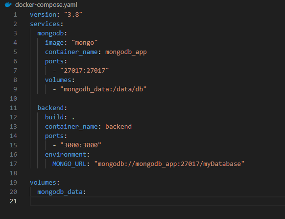

# Communication b/w containers

## Step 1: Clone the repo

## Step 2: Create volume (optional)

- Volume helps to persist the data even after container stop or deleted
- Without volume you can access previous data if you start the same container again `docker start <container_id>`

```bash
docker volume create volume_database
```

## Step 3: Create network

```bash
docker network create my_custom_network
```

## Step 4: Run mongo container

```bash
docker run --name mongo_container_name -v volume_database:/data/db --network my_custom_network -p 27017:27017 mongo
```

## Step 5: Update db.ts

```js
const mongoUrl: string = "mongodb://mongo_container_name:27017/myDatabase";
```

## Step 6: Build the image

```bash
docker build -t image_name .
```

## Step 7: Run project image

```bash
docker run --name backend --network my_custom_network -p 3000:3000 image_name
```

# Docker Image Push to Docker Hub

## Step 1: Build the image

- Needs to create an image with the same name as your repo

```bash
docker build -t your_username/image_name .
```

## Step 2: Login Docker Account

```bash
docker login
or
docker login --username YOUR_USERNAME
access-token
```

## Step 3: Push the image

- tagname used to variants by default tagname:latest

```bash
docker push your_username/your_reponame:tagname
```

## Step 4: Pull the image

```bash
docker pull repo_name:tagname
```

# Create an docker-compose.yaml

- Docker Compose is a tool designed to help you define and run multi-container Docker applications.
- With the single command, you can create and start all the services from your configuration.



- Start the compose

```
docker-compose up
```

- Stop everything (including volumes)

```
 docker-compose down --volumes
```
